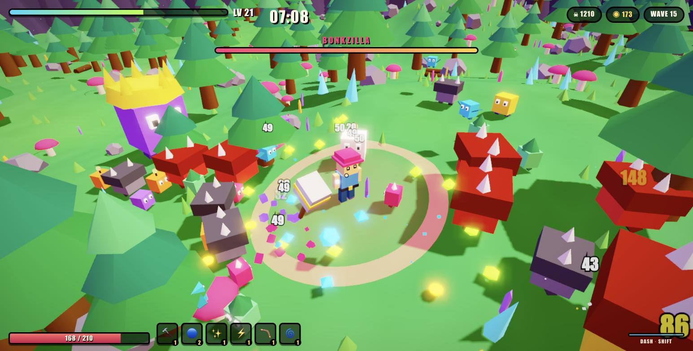
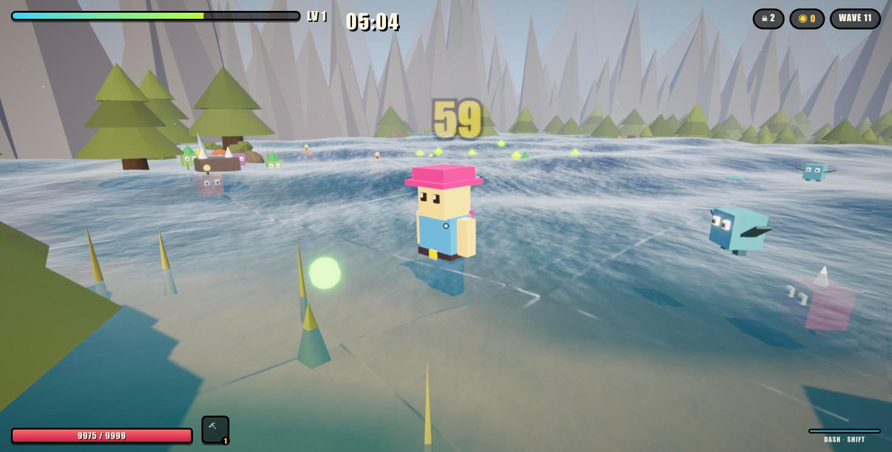

# 🔨 MEGABONK

A browser-based 3D survivor-roguelike in the spirit of **Megabonk** — pick a bonker, get swarmed,
auto-bonk everything, level up, and try to last 20 minutes.

No build step, no dependencies to install. Three.js is loaded from a CDN and the whole game is
plain ES5-flavoured JavaScript, so `index.html` runs straight from disk.



## Play

```bash
open index.html            # macOS — works directly from file://
# or, if you prefer a server:
python3 -m http.server 8765 && open http://localhost:8765
```

## Controls

The game detects the device by **pointer capability**, not by sniffing the user agent: a coarse
pointer with touch points means thumbs, whether that is a phone, a tablet or a Surface. A laptop
with a touchscreen but a real mouse keeps the desktop scheme.

### On a phone or tablet

Left thumb anywhere on the left of the screen raises a **virtual stick** — it is analog, so a light
push walks and a full push runs. Right thumb drags to swing the camera. **DASH** and **JUMP** sit
under your right thumb, pause is top right. Portrait shows a prompt to rotate, since the HUD needs
the long axis.

Touch devices also start on the LOW graphics tier with the render scale capped at 1× (phone DPRs are
often 3, and rendering at native resolution is the single most expensive mistake on mobile), fewer
props, and a smaller horde budget. All three tiers are still selectable by hand.

### On a computer

| Input | Action |
| --- | --- |
| `WASD` / arrows | Move |
| Mouse | Look (click the canvas to capture the pointer) |
| `Q` / `E` | Turn the camera without pointer lock |
| Mouse wheel | Zoom |
| `SHIFT` | Dash (i-frames while dashing) |
| `SPACE` | Jump |
| `P` / `ESC` | Pause + stat sheet |
| `1` – `3` | Pick a level-up card |
| `R` | Reroll the cards |
| `M` | Mute |

Graphics quality (LOW / MED / ULTRA) is on the menu and the pause screen.

Weapons fire on their own and auto-aim at the nearest enemy. You only steer, dodge, and choose upgrades.

## The run

- **20 minutes** to survive. Enemy health, damage, speed and spawn rate all climb with the clock,
  with a steep late health term so maxed weapons stop trivialising the horde. Past the scripted
  three, bosses keep returning on a shorter timer, angrier each time, and about a third of the
  horde spawns in front of you rather than around you — so running in a straight line no longer
  outruns it.
- Levels come **slowly and matter**: the XP curve is steep enough that an upgrade is a decision,
  not a drumbeat.
- **7 enemy types** — chasers, sprinters, flyers, armoured chunkers, exploding poppies, ranged spitters
  and megachunks — plus gold **elites** from about 2:30 onward.
- **3 bosses** at 3:00 and every 3:30 after that: Bonkzilla, The Chonker, and Megabonk itself.
- **XP gems** level you up; every level deals you three upgrade cards. Chests deal an extra card.
- **6 weapon slots**, 8 levels each, 19 passives.

## Bonkers

| | Character | Starts with | Traits |
| --- | --- | --- | --- |
| 🔨 | **BONKER** | Bonk Hammer | 110 HP, +10% damage |
| 👟 | **ZOOMER** | Spin Stars | 80 HP, very fast, two dashes |
| 🧙 | **WIZ** | Magic Missile | 85 HP, +25% area, faster casting |
| 🪨 | **CHONK** | Anger Aura | 160 HP, armour, regen, slow |

## Weapons

`🔨 Bonk Hammer` wide melee arc · `✨ Magic Missile` homing bolts · `🌟 Spin Stars` piercing spread ·
`🔵 Bonk Orbs` orbiting damage · `⚡ Bonk Bolt` random sky strikes · `🌀 Anger Aura` damaging slow field ·
`💣 Bonk Bomb` lobbed explosives · `🪃 Bonkerang` out-and-back piercer

## Code layout

```
index.html         markup + script order
css/style.css      HUD, menus, level-up cards
js/util.js         math, value noise, weighted rolls, localStorage
js/gfx.js          colour pipeline, material factory, quality tiers, ground decals
js/postfx.js       HDR buffer, bloom, ACES tone map, vignette, grade
js/audio.js        WebAudio synth — every sound is generated, no audio files
js/world.js        height-field terrain, instanced props, sky, arena bounds
js/fx.js           pooled damage numbers, particles, shockwaves, screen shake
js/player.js       characters, stats, movement, dash, XP
js/enemies.js      enemy types, spawn director, spatial grid, loot
js/weapons.js      weapon definitions, projectiles, orbitals
js/upgrades.js     the level-up card pool
js/ui.js           HUD + overlay rendering
js/game.js         renderer, camera, input, main loop
```

Everything that spawns repeatedly — enemies, projectiles, damage numbers, particles, pickups — is
pooled and reused. Enemy proximity queries go through a uniform spatial grid rather than scanning
the whole horde, so a 200-enemy screen costs well under a millisecond of game logic per frame.

## Graphics

The renderer runs a physically based, linear-light pipeline with a hand-written post chain — no
three.js example files, so the whole game is still one CDN script plus this repo, and still opens
from disk.

- **PBR materials everywhere.** Everything in the world is `MeshStandardMaterial` lit by a
  pre-filtered environment map, so surfaces respond to sky light and roughness instead of looking
  like flat paint.
- **Procedural surfaces.** There are no texture files: ground, bark and stone albedo maps are
  generated once from value noise into canvases, with matching normal maps derived by a Sobel pass,
  giving real surface relief under the moving sun. The noise wraps its lattice, so the textures tile
  with no seam — plain value noise does not wrap and laid a visible grid across the ground.

- **HDR scene buffer.** The scene renders into a half-float, 4× multisampled render target, so
  highlights can exceed 1.0 instead of clamping to white.
- **Bloom.** Bright-pass, then separable Gaussian blurs at half and quarter resolution, composited
  back over the scene. Emissive gems, crystals, magic bolts, lightning, the sun and the water glint
  are all authored above 1.0 specifically to catch it.
- **ACES tone mapping**, an sRGB encode, a light saturation/contrast grade and a vignette all happen
  in one composite pass. Every colour in the game is converted sRGB → linear on the way in, so the
  lighting maths is done in the space it assumes.
- **Water.** The lake is a custom shader — three summed wave trains with analytic normals, a Fresnel
  tint, a sun glint pushed past 1.0, and per-vertex baked depth that fades the surface out at the
  shoreline and draws foam on the shallows.
- **Terrain.** A value-noise height field shaded by altitude, slope and two scales of colour drift,
  with rock breaking through wherever the ground gets steep.
- **Wind.** Grass, reeds, flowers and tree canopies sway via an injected vertex-shader term, gusting
  on a second, slower wave.
- **Sun shafts.** The bright pass is smeared radially from the sun's projected screen position — a
  cheap stand-in for volumetrics that sells the low sun behind the treeline.
- **Baked contact AO.** Real SSAO would need a depth prepass over the whole horde every frame, so
  the darkening around every solid prop is baked into the terrain's vertex colours at build time
  instead: no runtime cost, and it seats the scenery into the ground rather than letting it float.
- **Extras.** Distant mountain silhouettes, drifting additive motes, glowing projectile trails,
  per-instance colour variation so a thousand copies of a mesh don't read as a repeated stamp, and
  soft ground blobs under every character.

Quality is chosen automatically from what the GPU reports and steps itself down if the frame rate
sags; **LOW / MED / ULTRA** are also selectable on the menu and pause screens. On low, bloom, MSAA
and shadows switch off and the render scale drops.

### Solid scenery

Trees, boulders, crystals, logs and bushes are real obstacles for the player, the horde, and most
shots. Because scenery is drawn with `InstancedMesh` there are no per-prop objects to raycast, so
each solid prop registers an upright cylinder collider at build time into a uniform grid. Colliders
are created in the same loop that places the visuals, so they always match what is on screen at any
prop density.

Colliders carry a height, which makes them behave the way they look: you can jump a knee-high
boulder but not a pine, and bats fly over rocks while still weaving between trunks. Blocked movers
slide along an obstacle instead of sticking, and the horde steps around trees toward whichever
tangent points at you. Bosses are exempt — they flatten scenery. Shots stop at the first trunk,
except the bonkerang, which turns for home. Mushrooms, grass, ferns and flowers stay walk-through:
tripping on ankle-height scenery feels awful in a horde game.

### Swimmable water

The lake is deep enough to swim. Past about half a metre of depth you stop walking the bottom and
float at the surface at roughly half speed, trailing a wake and unable to jump properly out of deep
water. Enemies do exactly the same thing, so the lake is a real tactical feature — a slow lane you
can cross to buy space, or get caught in. Flyers ignore it entirely.



The basin is an explicit profile rather than a blend toward a low point: a flat floor out to three
quarters of the radius, then a steep shelf up to a rim just above the waterline. A smoothstep blend
produces a shallow cone whose middle is the only part under water — that left the lake covering 50%
of the basin radius (25% of its area) with a 15-unit dry bowl ringing it. The profile fills 92% of
the radius, 4.4 units deep, with a beach a few metres wide.

The surface is a custom shader: a sum of four travelling waves with analytic normals, three layers
of scrolling procedural ripple normals over the top, a Fresnel-weighted sky reflection, a sun glint
pushed past 1.0 so the bloom pass catches it, whitecaps on genuine crests and a lapping foam line at
the shore. Depth is baked per vertex, so the shallows stay see-through while deep water turns
opaque, and the swell damps to nothing at the waterline instead of climbing the beach.

Swimmers sit at a waterline scaled to their own size. A single submersion depth tuned for the
player left a Bonkling completely under the surface — which is why the horde looked like it was
walking along the lake bed rather than swimming. Every body now floats with roughly half of itself
out of the water, whatever its size, and animates a flutter kick and forward lean instead of a
walking stride, leaving a wake behind it.

**The waves are defined once and used twice.** `World.WAVES` is evaluated by the vertex shader to
displace the surface, and the same table is emitted into the GLSL from JavaScript so the CPU can
evaluate the identical sum. Swimmers therefore ride the actual water: measured across eight
swimming enemies, feet track the rendered surface to within 3 cm. Dropped gems bob on it too, and
debris skips off it rather than sinking to the lake bed.

### Ground decals follow the terrain

Anything drawn flat on the ground — the aura ring, dash and explosion shockwaves, the blob under
each character — is a subdivided disc whose vertices are re-projected onto `World.heightAt` every
frame, rather than a flat circle. On a flat circle, a slope buries the uphill half and floats the
downhill side; measured on this map's steepest ground, a flat disc deviates from the surface by
0.68 m while the projected one tracks it to within its own 0.07 m lift. The many small enemy blobs
use a cheaper version that aligns the disc with the local ground normal.

## Notes

- Desktop only — there are no touch controls.
- Local scripts and CSS are loaded with a version stamp (`?v=…`). Without it a returning player can
  get a fresh `game.js` against a cached `postfx.js` and the game breaks on load; bump the stamp in
  `index.html` whenever files change.
- Terrain height comes from a value-noise field sampled analytically, so anything that needs to sit
  on the ground shares one `World.heightAt(x, z)` function with the rendered mesh.
- Tested against three.js r128, whose UMD build works from `file://` without a module server.
